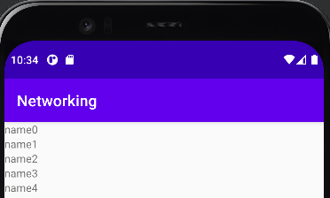
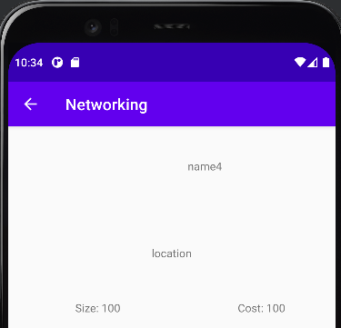

# Rapport
Appen hämtar data med hjälp av json och lägger sedan till den datan i ett nytt objekt, och läggar in objektet i en lista.
Den använder sedan dessa objekt för att skriva ut namnet på objekten i en recyclerView.
Klickar man på ett av namnen så kommer man till en ny aktivitet som visar den fulla informationen av objektet. 


Det behövs en lista med alla värden som ska sättas ut i min recyclerView. 
Jag hittar min recyclerView från layouten med finViewById
Jag tilldelar min recyclerView en layoutmanager
Jag skapar en recycleradapter och tilldelar den till min recyclerView.
```
list = new ArrayList<Mountain>();
rv = findViewById(R.id.myRecycler);
rv.setLayoutManager(new LinearLayoutManager(this));
mAdapter = new MountainAdapter(list, MainActivity.this);
rv.setAdapter(mAdapter);
```

Jag skickar med min lista i konstruktorn för min recycler adapter.
Jag skickar även med en Context så att jag kan kalla på en ny aktivitet från adaptern. 
```
public MountainAdapter(List<Mountain> dataset, Context context){
    localDataSet = dataset;
    activity = context;
}
```

Här ser vi hur jag kallar på den nya aktiviteten från min adapter. 
```
public void onClick(View view) {
    clicked = localDataSet.get(getAdapterPosition());
    Intent i = new Intent(activity, MountainInfo.class);
    i.putExtra("mountain", clicked);
    activity.startActivity(i);
}
```


Bild 1 visar mainaktiviteten och bild 2 visar mountaininfo aktiviteten.



